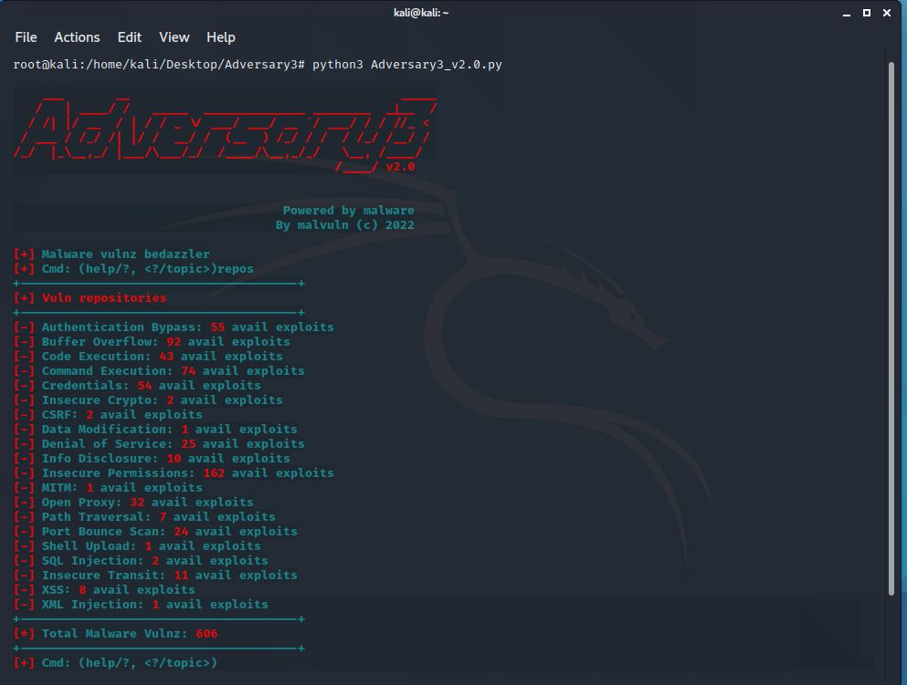

# Adversary3 

#SHA256: 40E1265EEBA4D28CFD8FCFA836984B58CF69A80DA72F26D59DCF6510CB3E7C43
Malware vulnerability intel tool for third-party attackers or defenders.  
By John Page (aka hyp3rlinx) Copyright (C) TM 2022

www.malvuln.com  
x.com/malvuln  
twitter.com/malvuln  
twitter.com/hyp3rlinx  
malvuln13@gmail.com  
ISR: ApparitionSec  
hyp3rlinx.altervista.org  

v3.3   
Added SHA256 command to return the SHA256 hash for a malwares MD5
Added: 34 new malware vulnerabilities, as of Sept 2024 the grand total is now 700 findings

Adversary3.py navigates the vast www.malvuln.com malware vulnerability dataset.
Need a way in but no 0day?, choose the path of least resistance and
work off the backs of others (virus) flaws.
Yes, shot in the dark... but vuln backdoors, trojans and virus exist.
Redteam? look for infected hosts with unsecured backdoors, BoF or RCE.
On a system with low privs? look for infections with weak permissions
you get the idea third-party adversary! living off the malware (LOTM)

NOTE: Tested on Windows 10 Python3 / Kali (Python3)  
Requirements: Windows OS > 7 and Python 3  
Run on Kali: python3 Adversary3.py  

Adversary3 Commands:  
===================  
repos: Lists repositories, vulns and amount of each vuln class. 
credz: Malware backdoors [PASSWORD] list. 
familia: Search number of [VULNS] for all or specific malware [FAMILY]. 
ports: Lists vuln backdoor malware ports. 
md5: Search vulns based on a MD5 malware hash. 
mvid: Search vulns based on a MVID malware advisory. 
vulns: Browse vuln categories and advisorys, based on the latest downloaded .Zip archive. 
md5family: Returns malware [FAMILY][MD5] by family, MD5 or *. 
shodan: Crawl the internet for a vuln malware port. Requires a Shodan Enterprise Data license. 
scan: Basic port scan for vuln malware ports using half open SYN packet. 
update: Download and update lastest Adversary3 .Zip from github.com/malvuln. 
id: Get MVID, MD5 by MVID, MD5 or wildcard * 
cls: Clears the [CONSOLE] window. 
about: Explanation of Adversary3. 
sha256: returns the SHA256 hash for a supplied MD5  

DISCLAIMER:
Author is NOT responsible for any damages whatsoever by using this software,
by using Adversary3 you assume and accept all risk implied or otherwise.

Permission is also explicitly given for insertion in vulnerability databases and similar,
provided that due credit is given to the author John Page (aka hyp3rlinx) (c) 2022
